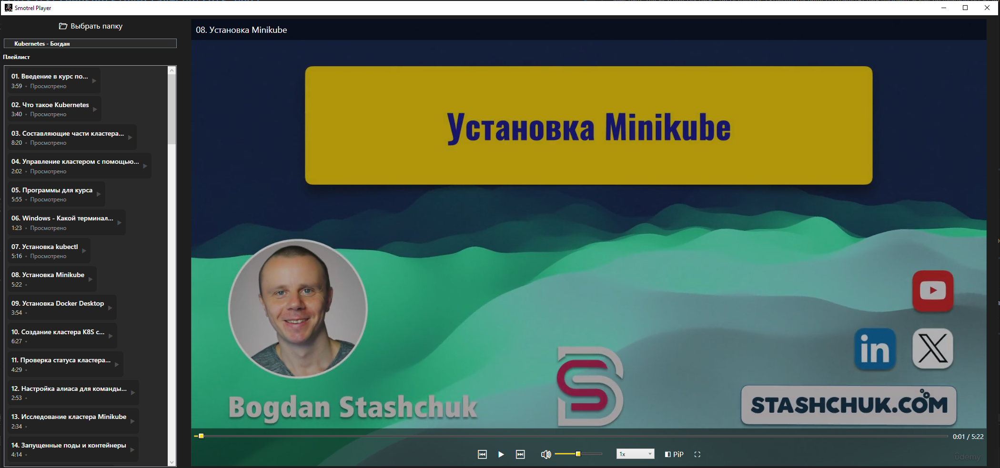
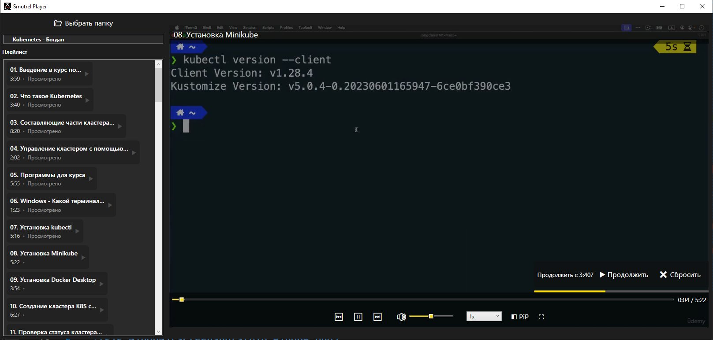
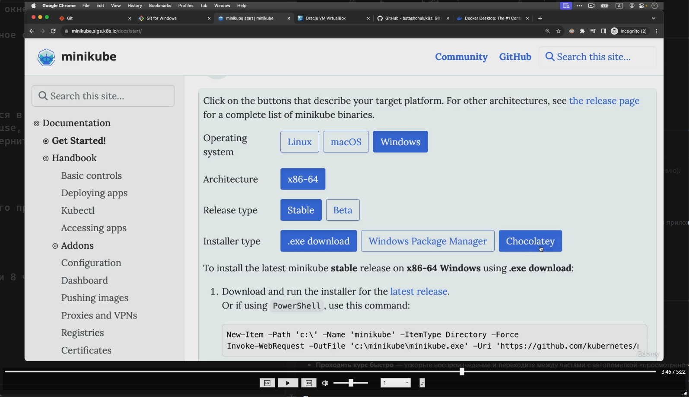

# Smotrel — обзор для пользователя

**Кратко:** Smotrel — лёгкий и удобный видеоплеер для прохождения курсов и видео-уроков. Сохраняет прогресс, умеет быстро переключаться между частями/главами, поддерживает Picture‑in‑Picture и имеет интуитивный интерфейс с удобными оверлеями.

---

## Что вы получаете (функционал для пользователя)

### Основные возможности

- Воспроизведение локальных видеофайлов (папки/главы/плейлисты).
- Сохранение позиции воспроизведения и возможность продолжить (resume).
- Маркирование части как **просмотрено** при её завершении.
- Управление воспроизведением: play/pause, перемотка, громкость, скорость.
- Переходы «следующая / предыдущая часть» и авто‑переход при окончании части.

### Picture‑in‑Picture (PiP)

- Плавающее окно PiP, которое всегда поверх остальных окон (Topmost) и его можно перемещать.
- PiP сохраняет позицию, скорость и громкость; при возврате всё синхронизируется с основным окном.
- В PiP доступны основные контролы: seek, play/pause, prev/next, volume, скорость.
- При активном PiP основной интерфейс показывает баннер «Воспроизводится в PiP».

### Интерфейс и удобства

- Плавный оверлей с контролами, который показывается при движении мыши и скрывается автоматически.
- Большой центральный индикатор Play/Pause при переключении.
- Баннер «Продолжить» (resume) при наличии сохранённой позиции — с кнопками «Продолжить» и «Сбросить».
- Жёлтая полоса под баннером показывает, сколько осталось до автоскрытия баннера.
- Умная обрезка названий: метки в квадратных скобках (`[platform]`) удаляются из отображаемого заголовка; при наведении показывается полный заголовок (tooltip).
- Плейлист: карточки с кратким названием, длительностью и состоянием (просмотрено/не просмотрено). Высота панели автоматически адаптируется под количество элементов.

### Настройки воспроизведения

- Выбор скорости воспроизведения (предустановки).
- Регулировка громкости в основном окне и в PiP.
- Опция управления поведением resume (включить/выключить автоматическое применение).

### Взаимодействие и удобные сценарии

- Двойной клик — переключение полноэкранного режима.
- Клик по видео — переключение play/pause (и в основном окне, и в PiP).
- Перемещение окна PiP через drag.
- Синхронизация позиции при закрытии PiP обратно в главное окно.

---

## Как использовать

1. Откройте приложение и выберите папку с курсом/видео.
2. В левой панели выберите главу/часть — видео загрузится в основной плеер.
3. Управляйте воспроизведением в нижней панели (play/pause, перемотка, громкость, скорость).
4. Нажмите PiP, чтобы вынести видео в плавающее окно; верните его кнопкой Restore.

---

## Скриншоты интерфейса

- Главное окно (плеер + плейлист)

- Resume banner(для чего нужен, пример: вчера досмотрели 8 часть до 3:40 и вышли, при следующем входе, в приложении автоматически включиться 8 часть, и появиться баннер продолжить с того места, или продолжить смотреть с начала)

- Picture‑in‑Picture (PiP)

---

## Для будущих релизов

- Поддержка файлов конфигурации, горячии клавиши и прочее для удобной настройки под себя.
- Главное меню с отображением текущих курсов в виде карточек, для удобного перехода между курсами.